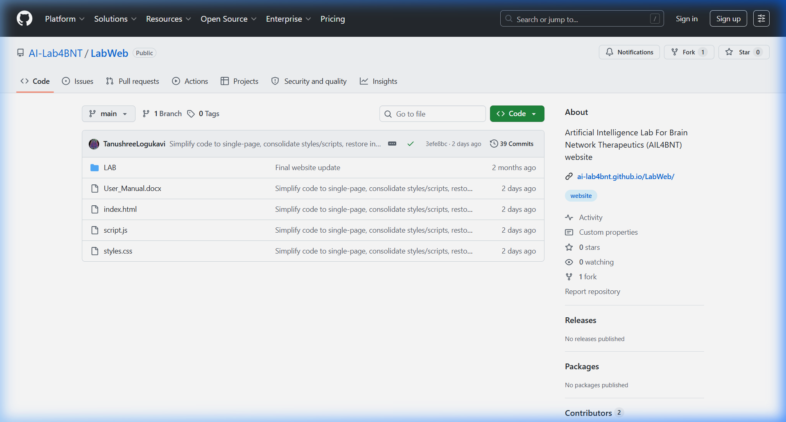
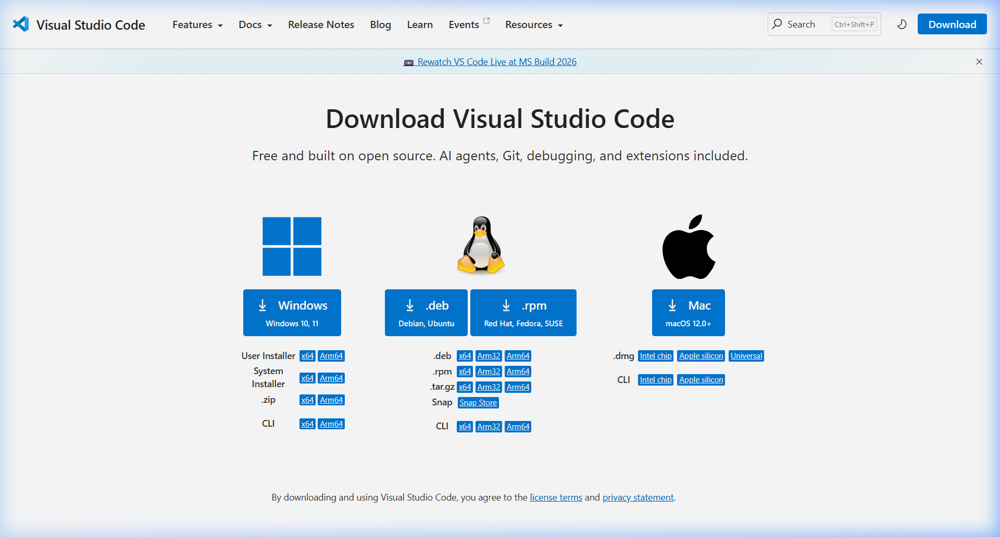
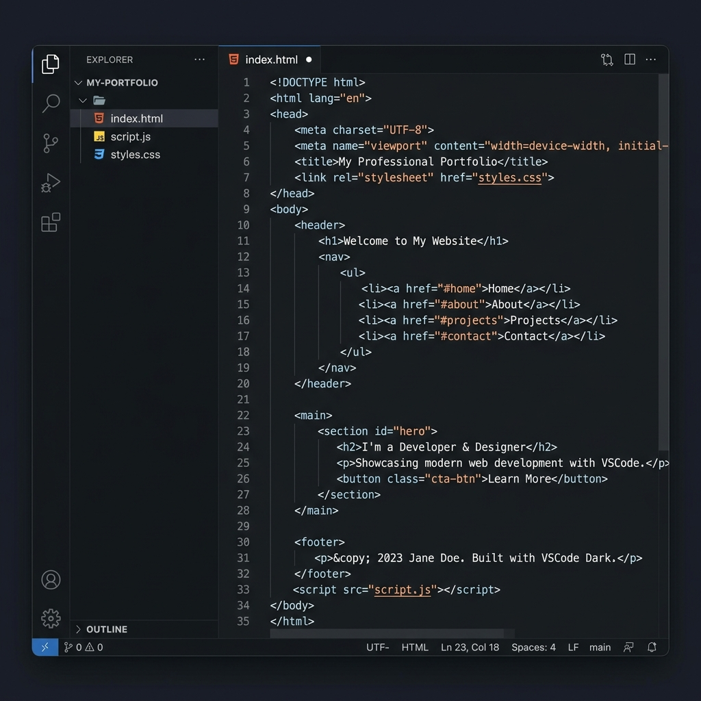
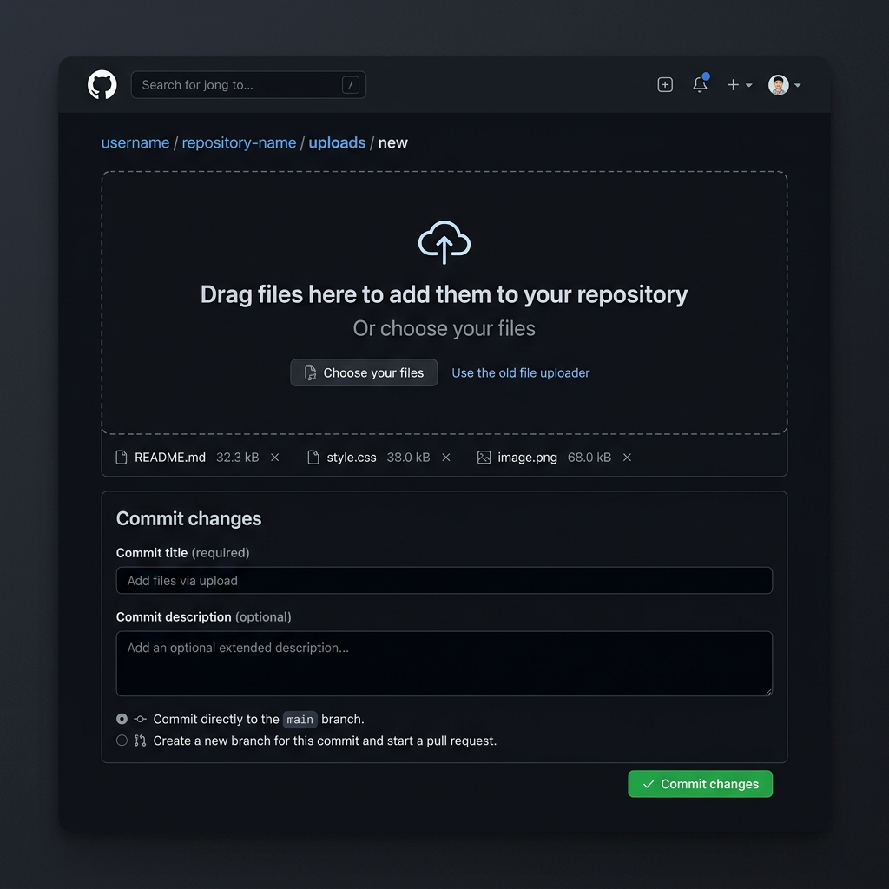

# CNPN LAB WEBSITE CONTENT UPDATE MANUAL
## A Non-Coder's Guide to Editing and Maintaining the Lab Website
*An Illustrated Step-by-Step Guide for Non-Technical Users to Keep the Lab Website Updated*

---

## 1. Introduction
This user manual provides step-by-step instructions for non-programmers to update the content of the Clinical Neurophysiology & Precision Neuromodulation Lab (CNPN Lab) website. The site is designed so that all content (text, research themes, people profiles, recognition, and publications) is stored in a structured format at the top of a single JavaScript file named `script.js`. You do not need to edit any complex HTML or CSS layouts. By following this guide, you will be able to make changes and add new items easily.

---

## 2. General Rules for Non-Coders
When editing content, you are writing text inside JavaScript arrays or objects. JavaScript requires strict grammar rules. Breaking these rules will cause the website to display a blank page or stop functioning. Please follow these precautions:
* **Always Make a Backup:** Before making any changes to `script.js`, copy it and save it as `script_backup.js` in a separate folder. If something goes wrong, copy-paste your backup file back to restore the site.
* **Double Quotes:** All text must be wrapped inside double quotation marks. E.g., `"My research text"`. If your text contains a quotation, use single quotes inside double quotes, e.g., `"The target is 'personalized' neuromodulation."`
* **Commas are Crucial:** Every item in a list must be separated by a comma. Missing or extra commas are the most common source of page load issues. E.g., `[item1, item2, item3]`.
* **Brackets and Braces must Match:** Ensure that every opening bracket `[` or curly brace `{` has a corresponding closing bracket `]` or curly brace `}`.
* **Use a Good Text Editor:** Do NOT use Microsoft Word or basic Notepad to edit code. Use a free programmer's text editor like Visual Studio Code (VS Code). This will highlight code syntax and point out errors.

---

## 3. Downloading the Project & Tool Setup

### 3.1 Downloading the Repository from GitHub
To get a copy of the lab website code on your computer:
1. Open your browser and go to the repository: [https://github.com/cn-pn/LabWeb](https://github.com/cn-pn/LabWeb)
2. Click the green **Code** button on the right-hand side of the page.
3. Select **Download ZIP** from the dropdown options.
4. Locate the downloaded file on your computer and extract it. This will create a folder containing all the website files.



### 3.2 Installing Visual Studio Code (VS Code)
1. Open your web browser and go to: [https://code.visualstudio.com/Download](https://code.visualstudio.com/Download)
2. Click the blue **Windows** button to download the installer.



3. Locate the downloaded file (e.g., `VSCodeUserSetup-x64-xxxx.exe`) and double-click to run the setup.
4. Accept the agreement and click **Next**.
5. **Critical Settings:** On the *Select Additional Tasks* screen, ensure you check the following options:
   * [x] **Add "Open with Code" action to Windows Explorer file context menu**
   * [x] **Add "Open with Code" action to Windows Explorer directory context menu**
   * [x] **Register Code as an editor for supported file types**
   * [x] **Add to PATH (requires shell restart)**
6. Click **Next**, then **Install**. Click **Finish** once setup is complete.

### 3.3 Opening the Project in VS Code
1. Right-click the extracted folder (`LabWeb-main`) in your file explorer, and select **"Open with Code"**.
2. Alternatively, open VS Code, click **File** -> **Open Folder...** (or press `Ctrl+K Ctrl+O`), navigate to the extracted folder, and click **Select Folder**.



* **[1] Explorer Sidebar:** Shows all project files (`index.html`, `styles.css`, `script.js`, and the `Lab` folder containing images).
* **[2] Source Control Sidebar:** Shows file changes and facilitates uploading to GitHub.

---

## 4. Step-by-Step Website Content Editing
All collaborator details, fellows, PhD members, publications, and recognitions are dynamically managed in `script.js`. Open `script.js` in VS Code to make changes.

### 4.1 Updating Collaborators and Partners
The Collaborators & Partners section displays clinical, translational, and technical partners. They are defined in lists starting around line 197.

#### A. Core Collaborators (Lines 197–204)
Search for: `const coreCollaborators = [`
Template to copy-paste or modify inside the list:
```javascript
  ["Dr. Full Name", "Description | Institution Name", "https://profile-url.com"],
```

#### B. Clinical & Translational Collaborators (Lines 206–210)
Search for: `const translationalCollaborators = [`
Template to copy-paste or modify inside the list:
```javascript
  ["Dr. Full Name", "Description | NIMHANS", "https://profile-url.com"],
```

#### C. Logo Mappings for New Collaborators (Lines 212–256)
If you add a new collaborator, search for: `function getCollaboratorLogoUrl`. Under this function, map their name to a custom logo image inside the `Lab/brand/` folder:
```javascript
  if (collaboratorName === "Dr. Full Name") return "Lab/brand/my-custom-logo.png";
```
*If no custom mapping is added, the system automatically falls back to `Lab/brand/logo.png`.*

#### D. Publication Clickable Link Mappings (Lines 280–311)
To make the collaborator's name clickable in the publications archive list, search for: `const personLinks = [`. Add the mapping:
```javascript
  ["Full Name", "https://profile-url.com"],
```

### 4.2 Updating the 'People' Section
The *About Us* section shows profile cards for the lab members.

#### A. Adding a Research Fellow (Lines 153–179)
Search for: `const fellows = [`. Copy and paste this template inside the array:
```javascript
{
  name: "Dr. Full Name",
  text: "Short summary paragraph of work in the lab.",
  isExpanded: true,
  expandedBio: "Biographical details paragraph 1.",
  expandedBio2: "Biographical details paragraph 2.",
  expandedBio3: "Biographical details paragraph 3.",
  expandedBio4: "Biographical details paragraph 4.",
  links: [
    ["LinkedIn", "https://linkedin.com/in/..."],
    ["Github", "https://github.com/..."]
  ],
  images: ["Lab/rf_tanushree/profile_slide1.jpg", "Lab/rf_tanushree/profile_slide2.jpg"],
  interests: [
    ["Painting 🎨", "A creative hobby description."]
  ]
},
```

#### B. Adding PhD & Other Members (Lines 181–195)
Search for: `const interns = [`. Copy and paste this template inside the array:
```javascript
{
  name: "Member Name",
  text: "Description of their education, research focus and roles.",
  images: ["Lab/intern_members/profile_photo.JPG"]
},
```

### 4.3 Updating Research Themes & Spotlight Publications
1. Search for: `const research = [` (Line 31).
2. Inside each theme, you can update `slides: [ ... ]` pointing to images inside the `Lab/research_themes/` folder, or edit the plain text `publications: [ ... ]` array list.

### 4.4 Updating 'Recognition' Section
The recognitions are stored in lists starting at line 388 (`const recognitions = { ... }`).
Templates inside `plenaryLectures`, `invitedTalks`, `conferencePresentations`, or `mediaRecognition`:
```javascript
{
  year: "2026",
  title: "Presentation title or award name",
  event: "Name of the conference or media outlet",
  topic: "Topic details (optional)",
  icon: "🎙️"
},
```

### 4.5 Updating 'Publications' Section
Publications are grouped by year in `const publications = [` (Line 415).
Add strings into the `items: [ ... ]` array under the appropriate year:
```javascript
"1. Authors. Paper title. Journal name. Year. DOI Link",
```

---

## 5. Previewing & Testing Changes Locally
1. Save changes in VS Code by pressing `Ctrl+S`.
2. Navigate to your local folder, and double-click `index.html` to open it in a web browser.
3. Always perform a **Hard Refresh** to override cached files and load your new `script.js` updates:
   * **Windows/Linux:** Press `Ctrl + F5` or `Shift + F5`
   * **macOS:** Press `Cmd + Shift + R`

---

## 6. Uploading and Publishing Changes to GitHub
Once you have verified that your edits work locally, upload them to publish the site live.

### Method A: Manual Web Upload (Drag-and-Drop)
This is the easiest method and requires no command-line tools:
1. Open your browser and go to: [https://github.com/cn-pn/LabWeb](https://github.com/cn-pn/LabWeb)
2. Click on the gray **"Add file"** button near the top right and select **"Upload files"**.
3. Drag and drop your modified files (e.g. `script.js`) into the box.
4. Scroll down to the **"Commit changes"** section.
5. Enter a brief description (e.g. *"Updated collaborator links"*), select **"Commit directly to the main branch"**, and click the green **"Commit changes"** button.



### Method B: Command-Line Upload (VS Code Terminal)
For faster and professional deployment, run these Git commands inside VS Code:
1. Open the Terminal in VS Code: Click **Terminal** -> **New Terminal** in the top menu or press `Ctrl + `` ` (Control and Backtick).
2. Copy, paste, and run the following commands sequentially inside the terminal:

```bash
# Change the remote to the cn-pn repository
git remote set-url origin https://github.com/cn-pn/LabWeb.git

# Stage your changes
git add .

# Commit your changes
git commit -m "Uploading LabWeb project from VS Code"

# Push to the main branch
git push -u origin main
```
3. If prompted, sign in via GitHub in the popup browser window to authenticate the upload.

### Method C: Source Control panel in VS Code (Git GUI)
1. Click the **Source Control** (git branch) icon in the left-hand sidebar or press `Ctrl+Shift+G`.
2. Hover over the modified files and click the **`+`** icon to stage them.
3. Type your commit message in the top textbox.
4. Click the checkmark (**Commit**) button at the top.
5. Click **"Sync Changes"** or **"Push"** to upload.

---

## 7. Managing Images and Sliders Updates
All website assets are structured inside the `Lab/` folder into dedicated subfolders for clean organization and easy updates. Always name your files logically before placing them in the subfolders.

### 7.1 Reorganized Asset Directories
The `Lab/` directory has the following subfolder structure:
* `Lab/brand/` — Contains logos (`logo_transparent.png`, `logo.png`), partner institution logos (`NTU.png`, `jhu-logo.png`, `NIMHANS.jpeg`, `SA.jpeg`), and background illustrations (`logo_background.jpeg`, `AIIMS.jpg`).
* `Lab/pi_sagarika/` — Contains profile slideshow images of the Principal Investigator (Dr. Sagarika Bhattacharjee) named `sagarika1.jpeg` to `sagarika6.jpeg`.
* `Lab/rf_tanushree/` — Contains profile slideshow images of the Research Fellow (Tanushree L) named `tanushree1.jpg` to `tanushree4.jpg`.
* `Lab/intern_members/` — Contains photos of interns and trainee members (e.g., `varsha.jpg`).
* `Lab/research_themes/` — Contains slides and diagrams shown in research theme popups, structured by theme (e.g. `theme1_slide1.png`, `theme2_slide1.jpeg`).
* `Lab/testimonials/` — Contains patient slides (`testimonial_slide1.jpeg` to `testimonial_slide10.jpeg`) and showcase highlights (`highlight_slide1.jpg` to `highlight_slide5.jpg`).
* `Lab/showcase/` — Contains the main showcase slide images for the hero carousel (`showcase_slide1.jpeg` to `showcase_slide5.jpeg`).

### 7.2 Replacing and Adding Images in Sliders
The website utilizes dynamic image sliders that read file pathways from `script.js` arrays. Below is a guide to updating each slider.

#### A. Home Showcase Slider (`startLabSlides`)
Images are stored in `Lab/showcase/` and defined in `startLabSlides` around line 378 inside `script.js`:
* **To replace an image:** Overwrite the target file (e.g. `showcase_slide3.jpeg`) in `Lab/showcase/` with a new photo using the same filename.
* **To add a new image:** Save your image in `Lab/showcase/` (e.g., `showcase_slide6.jpeg`) and add it to the array in `script.js`:
```javascript
  "Lab/showcase/showcase_slide6.jpeg",
```

#### B. Research Theme Sliders (`research[index].slides`)
Images are stored in `Lab/research_themes/` and defined in the research themes array at line 31 in `script.js`:
* **To add a slide:** Place the image inside `Lab/research_themes/` (e.g. `theme1_slide7.png`) and add a slide object to the theme's `slides` array:
```javascript
      { src: "Lab/research_themes/theme1_slide7.png", alt: "Description", caption: "Caption" },
```

#### C. Testimonial Sliders (`testimonialSlides` & `testimonialLeftSlides`)
Images are stored in `Lab/testimonials/` and defined around line 357 in `script.js`:
* **To add or edit slides:** Modify the `testimonialSlides` or `testimonialLeftSlides` arrays with their corresponding paths:
```javascript
  "Lab/testimonials/testimonial_slide11.jpeg",
```

#### D. PI Profile Slider (`piSliderHtml`)
Dr. Sagarika's profile images are in `Lab/pi_sagarika/` and are mapped as HTML tags in `piSliderHtml` template around line 957 in `script.js`:
* **To add a picture to the slideshow:** Place the new photo in `Lab/pi_sagarika/` (e.g. `sagarika7.jpeg`). Then, open `script.js`, search for `piSliderHtml`, and add a new image element inside the slider wrapper container:
```html
        
```

#### E. Research Fellow Profile Slider (`fellows[0].images`)
Tanushree's profile images are in `Lab/rf_tanushree/` and mapped inside the fellows list around line 167 in `script.js`:
* **To update her slider:** Save your new files in `Lab/rf_tanushree/` (e.g. `tanushree5.jpg`) and add the path to the images array:
```javascript
    images: ["Lab/rf_tanushree/tanushree1.jpg", ..., "Lab/rf_tanushree/tanushree5.jpg"],
```
